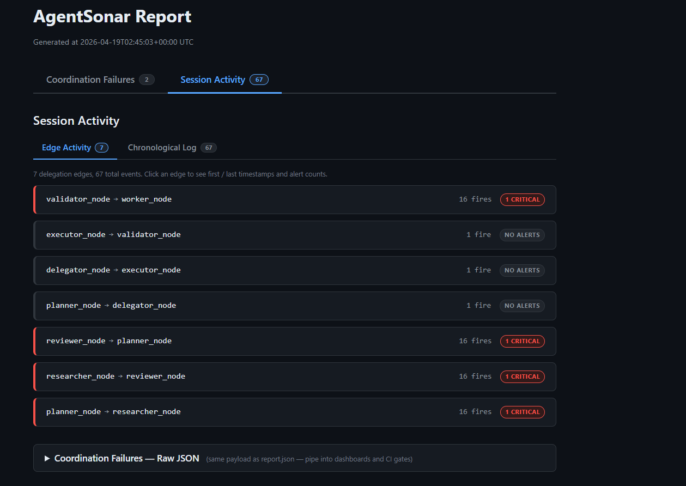

# @agentsonar/oma

AgentSonar integration for [Open Multi-Agent (OMA)](https://github.com/JackChen-me/open-multi-agent). Adds graph-level coordination observability to OMA workflows by bridging task dependencies and trace events to a local AgentSonar Python sidecar over HTTP JSON.

## What it detects

Three classes of multi-agent coordination failures, computed deterministically over the agent graph — no LLM-as-judge:

- **`cyclic_delegation`** — agent-to-agent delegation cycles that emerge across independent task chains or runs.
- **`repetitive_delegation`** — the same delegation edge repeated past an exponential-decay threshold.
- **`resource_exhaustion`** — per-edge throughput bursts beyond a sliding-window limit.

Output is a standalone HTML report at `agentsonar_logs/run-<slug>/report.html`.

## How this complements OMA's runtime guards

OMA blocks same-chain `A → B → A` cycles at delegate-tool time (`delegate.ts:60`). `@agentsonar/oma` catches the cumulative-graph patterns those guards don't see — cycles and repetition that emerge across independent chains or across runs.

## Install

```powershell
# TypeScript client
npm install @agentsonar/oma

# Python sidecar dependency
pip install agentsonar
```

The npm package ships with the Python sidecar script bundled at `node_modules/@agentsonar/oma/sidecar/sidecar.py`. Run it from there or copy it next to your app code:

```powershell
python node_modules/@agentsonar/oma/sidecar/sidecar.py
```

Requirements: Node 18+, Python 3.10+.

## Quickstart

```ts
import { OpenMultiAgent } from '@jackchen_me/open-multi-agent'
import {
  emitDelegations,
  createTraceHandler,
  shutdown,
  type DelegationTask,
} from '@agentsonar/oma'

const tasks: DelegationTask[] = [
  { title: 'research', description: '...', assignee: 'researcher' },
  { title: 'write',    description: '...', assignee: 'writer',
    dependsOn: ['research'] },
]

const orchestrator = new OpenMultiAgent({
  defaultModel: 'gpt-4o-mini',
  onTrace: createTraceHandler(),
})

const team = orchestrator.createTeam('my-team', { /* ... */ })

await emitDelegations(tasks)            // emit delegation edges before the run
await orchestrator.runTasks(team, tasks)
await shutdown()                        // write the report and close the sidecar
```

The sidecar must be running. The simplest setup is a separate terminal; for production, spawn it as a subprocess from your application.

## Run the included demo

Two terminals.

### Terminal 1 — start the sidecar

```powershell
python sidecar/sidecar.py
```

You'll see:

```
AgentSonar OMA sidecar listening on http://localhost:8787
  POST /ingest    — delegation events
  POST /trace     — OMA trace events (stashed for cost work)
  POST /shutdown  — write report.html + exit
  GET  /health    — liveness + current counts
```

### Terminal 2 — run the demo

```powershell
$env:OPENAI_API_KEY = "sk-..."
npm run demo
```

The demo runs a 4-task workflow `researcher → reviewer → writer → researcher` — the last task is a fact-check returning to the same researcher. The task DAG is linear, but the agent graph forms a 3-node cycle. `CycleDetector` fires `cyclic_delegation` on the third edge.

When the demo finishes, the sidecar prints the report path. Open it in a browser to see the graph and detected alerts.

## What the output looks like

Every run produces a self-contained HTML report at `agentsonar_logs/run-<slug>/report.html` — no external CSS or JavaScript, no network requests, dark mode that respects your system preference. Two top-level tabs organize the view:

**1. Coordination Failures** — the primary signal. One card per detected failure with severity badge, failure class (hover for a definition), fingerprint, and expandable topology / thresholds / provider-error / downstream-impact blocks. Filter chips at the top let you narrow to Critical or Warning with one click.


**2. Session Activity** — INFO-level context, always one click away. Two sub-tabs switch between lenses on the same run:

- **Edge Activity** — every delegation edge the graph saw, with fire count and severity attribution. Red border = edge involved in a critical alert, no border = clean.
- **Chronological Log** — raw event stream with timestamps. Rows color-coded where an alert fired: light red for critical, light orange for warning.



The "Coordination Failures — Raw JSON" drop-down at the bottom of every report carries the same payload as `report.json` — copy it straight into a dashboard or CI gate without opening a second file.

All four output files land in a per-run session directory under `agentsonar_logs/`:

| File | Written | Purpose |
|---|---|---|
| `timeline.jsonl` | **Live — flushed on every event** | Every event, one JSON object per line. Tail with `tail -f` to watch what's happening as your OMA run progresses. |
| `alerts.log` | **Live — flushed on every alert** | Signal-only, human-readable. The "just show me the problems" view. |
| `report.json` | On `shutdown()` | Structured summary report, deduped + inhibited. Pipe into your dashboard. |
| `report.html` | On `shutdown()` | The standalone two-tab HTML report shown above. |

## Configuration

Two config surfaces.

### TS client options (Node side)

Passed on every `emitDelegations` / `createTraceHandler` / `shutdown` call, or via env var.

| Option / env var | Default | Purpose |
|---|---|---|
| `endpoint` / `AGENTSONAR_ENDPOINT` | `http://localhost:8787` | Sidecar URL. |
| `timeoutMs` | `2000` | Per-request HTTP timeout in ms. |
| `debug` | `false` | Log wire activity to stderr. |

### Detection thresholds (sidecar side)

Pass as CLI flags to the sidecar, or set env vars before starting it. Run `python sidecar/sidecar.py --help` for the full list.

| Flag | Env var | Default | Controls |
|---|---|---|---|
| `--warning-threshold` | `AGENTSONAR_WARNING_THRESHOLD` | `5` | Rotations / events to fire WARNING |
| `--critical-threshold` | `AGENTSONAR_CRITICAL_THRESHOLD` | `15` | Rotations / events to escalate to CRITICAL |
| `--per-edge-limit` | `AGENTSONAR_PER_EDGE_LIMIT` | `10` | Max events on one edge in the window |
| `--global-limit` | `AGENTSONAR_GLOBAL_LIMIT` | `200` | Max total events in the window |
| `--window-size` | `AGENTSONAR_WINDOW_SIZE` | `180.0` | Rate-limiter sliding window in seconds |
| `--half-life` | `AGENTSONAR_HALF_LIFE` | `180.0` | `repetitive_delegation` decay half-life |
| `--z-score-threshold` | — | `3.0` | Z-score to fire `repetitive_delegation` |
| `--resolve-after` | — | `60.0` | Seconds before alerts auto-resolve |
| `--log-dir` | `AGENTSONAR_LOG_DIR` | `.` | Where `agentsonar_logs/` lands |
| `--port` | `AGENTSONAR_PORT` | `8787` | Sidecar HTTP port |
| `--no-console` | — | — | Suppress alert streaming to stderr |
| `--no-report` | — | — | Skip the HTML/JSON report write |
| `--report-title` | `AGENTSONAR_REPORT_TITLE` | `"AgentSonar Report"` | HTML report title |

Resolution order: CLI flag > env var > SDK default.

**Example: tighter thresholds for testing**

```powershell
python sidecar/sidecar.py --warning-threshold 1 --critical-threshold 2
```

**Example: alternate port**

```powershell
python sidecar/sidecar.py --port 9100
```

Then on the Node side:

```ts
await emitDelegations(tasks, { endpoint: 'http://localhost:9100' })
```

## Sidecar lifecycle

One sidecar process = one observation session = one final report. The model is shaped for short-lived workloads (CLI tools, demos, batch jobs). Match your usage to one of these patterns:

| Pattern | Setup |
|---|---|
| **One-shot script** (the demo, CLI tools) | Start sidecar in another terminal. Your script calls `shutdown()` at the end → sidecar writes the report and exits. |
| **Long-running web server / app** | Start the sidecar once at process startup. Make many `runTasks` calls over its lifetime. Call `shutdown()` ONCE when your process exits — not between runs. All runs accumulate into a single report. |
| **Multiple concurrent sessions** | Run a separate sidecar per session, each on a different port via `--port`. Each emits its own report. |

If you call `shutdown()` between runs, the next call has no sidecar to talk to and operates as if it were unreachable (silent no-op). The next run won't be observed unless you start a fresh sidecar first.

The sidecar is **stateless across restarts** — killing and restarting it loses the in-memory graph for the current session. There's no checkpointing in v1.

## Architecture

```
┌────────────────────┐            ┌──────────────────────────┐
│  OMA app (Node.js) │            │  AgentSonar sidecar (py) │
│  ┌──────────────┐  │ HTTP JSON  │  ┌────────────────────┐  │
│  │ OpenMultiAgent│──┼─localhost─▶│  │ monitor_orchestra- │  │
│  │   onTrace     │  │   :8787    │  │  tor() engine      │  │
│  └──────┬────────┘  │            │  └─────────┬──────────┘  │
│         │           │            │            ▼             │
│  ┌──────▼────────┐  │            │  ┌────────────────────┐  │
│  │ emitDelegations│──┼───────────▶│  │  detection layers  │  │
│  │ from dependsOn │  │            │  │  cycle / repetitive│  │
│  └────────────────┘  │            │  │  rate / SCC        │  │
│                      │            │  └─────────┬──────────┘  │
│                      │            │            ▼             │
│                      │            │  agentsonar_logs/        │
│                      │            │   run-<slug>/            │
│                      │            │   ├─ report.html         │
│                      │            │   └─ report.json         │
└──────────────────────┘            └──────────────────────────┘
```

The TypeScript client is fire-and-forget. Every HTTP call has a 2-second timeout, every public function wraps its body in try/catch, and every fetch failure is swallowed silently (with a single console warning the first time the sidecar is unreachable). If the sidecar is down, slow, or throwing, the OMA run completes normally without observability — never with a crash. This invariant is enforced by the test suite (`npm test`).

## Links

- **AgentSonar** — [GitHub](https://github.com/agentsonar/agentsonar) · [PyPI](https://pypi.org/project/agentsonar/) · [npm `@agentsonar/oma`](https://www.npmjs.com/package/@agentsonar/oma)
- **Open Multi-Agent** — [GitHub](https://github.com/JackChen-me/open-multi-agent) · [npm `@jackchen_me/open-multi-agent`](https://www.npmjs.com/package/@jackchen_me/open-multi-agent)
- **Issues / feature requests** — [agentsonar/agentsonar issues](https://github.com/agentsonar/agentsonar/issues)

## License

Apache-2.0
